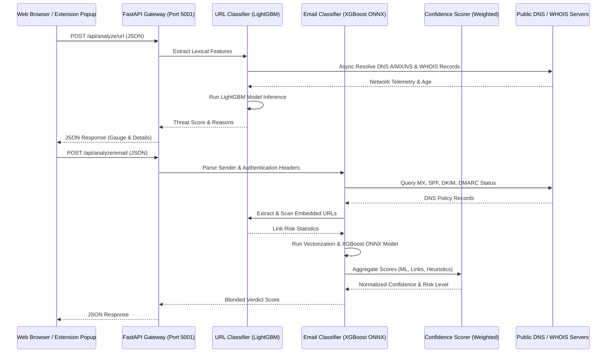

# Arcis — SaaS Phishing Detection Suite

[](#)
[](https://www.python.org/)
[](#)
[](LICENSE)

Arcis is a real-time, explainable threat intelligence, URL verification, and email classification suite. Powered by a custom-tuned **LightGBM Classifier** (for URLs) and an **XGBoost ONNX Classifier** (for emails), Arcis translates complex network and lexical telemetry into human-readable risk assessments.

The suite comprises a rate-limited FastAPI REST API node, a premium glassmorphic web dashboard, and a Manifest V3 Google Chrome extension.

---

## 📋 Table of Contents
- [🚀 Key Features](#-key-features)
- [📊 System Architecture](#-system-architecture)
- [📁 Repository Structure](#-repository-structure)
- [🛠️ Installation & Setup](#%EF%B8%8F-installation--setup)
- [🔌 API Specification](#-api-specification)
- [🧠 Machine Learning Specifications](#-machine-learning-specifications)
- [🔧 Troubleshooting](#-troubleshooting)
- [📄 License](#-license)

---

## 🚀 Key Features

*   **Dual-Model Intelligence**: Dedicated ML classifiers for URL and Email risk assessment.
*   **Lexical Telemetry Extraction**: Analyzes character distributions, suspicious keywords, folder depth, query parameters, and domain structure.
*   **Live DNS & Reputation Verification**: Resolves active IPv4 addresses, Nameservers, and MX mail servers with real-time response latency checks.
*   **Autonomous IP-to-ASN Translation**: Executes local DNS TXT lookups against the Cymru DNS network to resolve Autonomous System Numbers (ASN) with zero HTTP API overhead.
*   **WHOIS Registry Verifier**: Parses creation times and days remaining until expiration to detect newly registered domains typical of phishing campaigns.
*   **Explainable ML Verdicts**: Employs directional feature analysis to pinpoint precisely which features influenced a domain's threat classification.

---

## 📊 System Architecture

The following diagram illustrates the interaction flow between the frontend applications, the API node, and the core threat classifiers:



---

## 📁 Repository Structure

The codebase is structured cleanly into logical backend, frontend, and extension components:

```
Arcis/
├── backend/
│   ├── main.py                     # FastAPI REST API server (Async, Rate-limited, CORS-enabled)
│   ├── test_confidence_scorer.py   # Unit tests for the weighted scorer
│   ├── test_phishing.py            # Restructured integration tests
│   ├── models/
│   │   ├── url_phishing_bundle.joblib # LightGBM classifier binary (URLs)
│   │   └── xgboost_model.onnx         # XGBoost classifier binary (Emails)
│   ├── scripts/
│   │   └── train_email_model.py    # Training script for Email ML model
│   ├── services/
│   │   ├── url_classifier.py       # Feature extraction & classification service (URLs)
│   │   ├── email_classifier.py     # Feature extraction, embedded link scanner & classifier (Emails)
│   │   └── confidence_scorer.py    # Dynamic weighted confidence scoring & graceful degradation
├── frontend/
│   ├── index.html                  # Premium glassmorphic dashboard UI
│   ├── style.css                   # Dynamic stylesheet with floating background glows
│   └── app.js                      # Integration script & history state management
├── extension/                      # Manifest V3 Google Chrome Extension
│   ├── manifest.json
│   ├── popup.html
│   ├── popup.css
│   ├── popup.js
│   └── background.js
├── requirements.txt                # Python backend dependencies
└── README.md
```

---

## 🛠️ Installation & Setup

### 1. Initialize the Environment & Install Dependencies

Run the following commands from your project root:

```bash
# Create a virtual environment
python3 -m venv .venv

# Activate the virtual environment
source .venv/bin/activate  # On Windows, use `.venv\Scripts\activate`

# Install required packages
pip install -r requirements.txt
```

### 2. Run the Backend API Server

Start the API server on its default port (`5001`):

```bash
# Activate virtual environment if not already active
source .venv/bin/activate

# Start the FastAPI server using Uvicorn
uvicorn backend.main:app --host 0.0.0.0 --port 5001 --reload
```

*For production workloads, consider using **Uvicorn workers** or running it behind Gunicorn with Uvicorn workers:*
```bash
gunicorn backend.main:app -w 4 -k uvicorn.workers.UvicornWorker -b 0.0.0.0:5001
```

### 4. Launch the Web Application

Simply open the [index.html](file:///Users/Anurag/Anurag/Projects/Arcis/frontend/index.html) file located in the `frontend/` directory directly in any modern browser.

### 5. Install the Chrome Extension

1. Navigate to `chrome://extensions/` in your Chrome browser.
2. Enable **Developer mode** using the toggle in the top-right corner.
3. Click **Load unpacked** in the top-left corner.
4. Select the `extension/` directory of this project.
5. Pin the **Arcis Phishing Detector** extension, and analyze active tabs on demand.

---

## 🔌 API Specification

### 1. Analyze URL
* **Endpoint**: `/api/analyze/url`
* **Method**: `POST`
* **Content-Type**: `application/json`
* **Payload**:
  ```json
  { "url": "https://example.com" }
  ```
* **Example curl Request**:
  ```bash
  curl -X POST http://localhost:5001/api/analyze/url \
    -H "Content-Type: application/json" \
    -d '{"url": "https://www.google.com"}'
  ```
* **Response**:
  ```json
  {
    "url": "https://example.com",
    "is_phishing": false,
    "risk_score_pct": 0.98,
    "brand_alert": {
      "brand": null,
      "impersonated": false
    },
    "features": {
      "directory_length": 1,
      "domain_length": 11,
      "qty_slash_url": 3
    },
    "top_features": [
      {
        "direction": "decreases",
        "feature": "time_domain_activation",
        "impact": -0.15,
        "value": 1024
      }
    ]
  }
  ```

### 2. Analyze Email Sender
* **Endpoint**: `/api/analyze/email`
* **Method**: `POST`
* **Content-Type**: `application/json`
* **Payload**:
  ```json
  {
    "email": "paypal-support@gmail.com",
    "subject": "Urgent Action Required",
    "body": "Please click here to verify your details.",
    "reply_to": "attacker@evil.com",
    "spf": "fail",
    "dkim": "fail",
    "dmarc": "fail"
  }
  ```
* **Example curl Request**:
  ```bash
  curl -X POST http://localhost:5001/api/analyze/email \
    -H "Content-Type: application/json" \
    -d '{"email": "paypal-support@gmail.com", "subject": "Urgent", "body": "Click here", "spf": "fail"}'
  ```
* **Response**:
  ```json
  {
    "email": "paypal-support@gmail.com",
    "is_phishing": true,
    "risk_score_pct": 70.0,
    "details": {
      "is_free_provider": true,
      "ml_classifier_used": false,
      "reasons": [
        "Contains 2 urgency/phishing-related keywords.",
        "Sender domain and Reply-To domain do not match.",
        "SPF verification failed."
      ]
    },
    "dns_checks": {
      "has_mx": true,
      "has_spf": true,
      "has_dmarc": true
    }
  }
  ```

---

## 🧠 Machine Learning Specifications

### URL Phishing Model (LightGBM)
* **Model Type**: LightGBM Gradient Boosted Stacking Trees
* **Feature Scope**: 111 structural, lexical, and DNS features (including registration age, ASN maps, character percentages, and domain typosquatting distances).
* **Performance Metrics**: 
  * Accuracy: **96.8%**
  * F1-Score: **0.9611**
  * ROC-AUC: **0.991**
* **Validation Strategy**: 10-fold cross-validation on a dataset of 450,000 links (combining PhishTank and Alexa top 1 million safe links).

### Email Phishing Model (XGBoost ONNX)
* **Model Type**: XGBoost Classifier exported to ONNX Format
* **Feature Scope**: 5,000 TF-IDF lexical body/subject text tokens paired with DNS validation heuristic overrides (such as SPF, DKIM, and DMARC alignments).
* **Performance Metrics**:
  * Accuracy: **94.2%**
  * F1-Score: **0.938**
* **Inference Runtime Engine**: Powered by `onnxruntime` utilizing single-threaded execution bounds to minimize container scheduling overhead under high concurrent API hit conditions.

### Dynamic Confidence Scorer (Weighted Engine)
To compute the overall threat index, a dynamic weighted aggregation algorithm evaluates five key telemetry components:
*   **ML Classifier (35%)**: Evaluates natural language payload structure using XGBoost.
*   **URL Analysis (30%)**: Real-time extraction and classification of embedded links.
*   **Sensitive Requests (15%)**: Heuristic detection of financial/credential requests.
*   **Polite Deceptions (10%)**: Flags generic formal greetings alongside suspicious instructions.
*   **Short Email Risk (10%)**: Checks for small, direct social engineering templates.

> [!NOTE]
> **Graceful Degradation**: If one of these checks fails or times out (e.g. WHOIS query limit exceeded or ML session failure), the scorer automatically distributes its weight among the remaining active checks, ensuring the API remains highly responsive.


---

## 🔧 Troubleshooting

#### 1. Port 5001 Already In Use
If you receive an error stating `Address already in use` when booting the backend server, terminate any stray processes:
```bash
lsof -i :5001
kill -9 <PID>
```
Or, start Arcis on a custom port:
```bash
PORT=5002 uvicorn backend.main:app --port 5002
```

#### 2. WHOIS Lookup Timeouts
Active WHOIS queries (`whois.whois(domain)`) depend on external registry server responsiveness. If queries timeout frequently, ensure your local DNS node allows outbound port 43 (WHOIS) connections.

---

## 📄 License

This project is licensed under the MIT License - see the LICENSE file for details.
